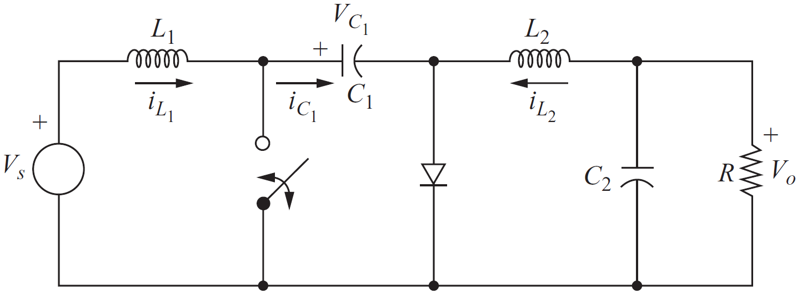
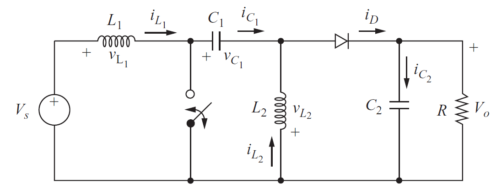

# EE 464 Homework#1

## Device Parameters

### Deadline: 18/04/2021 23:59

Please check [evaluation.md](evaluation.md) for other details and evaluation criteria about the project. Open a **private repository**, which you will put all your work into. Please add Ogün(/OgunAltun) as a collaborator.

Your boss at Hubelsan requires you to design a converter which reduces 24 V DC to 16 V DC. The design options that you have for this task are Buck-Boost Converter, Ćuk Converter and SEPIC Converter. The converter should be able to supply 32 W at switching frequency of 50 kHz. Moreover, output voltage ripple should not be greater than 2%. You will be examining each of these three topologies in order to find the best converter for the application.

**1) Buck-Boost Converter Design** 

  **a)** Analytically determine the value of inductance for converter to be in CCM operation with 10% ripple current.

  **b)** Analytically find the output capacitance value in order to have 2% output voltage ripple.

  **c)** According to your calculations, find commercial products for inductors, capacitors and semiconductors from [Digikey](https://www.digikey.com/). Explain your reasoning for selections.

  **d)** Validate your results by constructing the designed buck-boost converter in Matlab/Simulink environment **with non-idealities,** meaning ESR values of capacitors and inductors, which you can find in the datasheets of the products. You can use ideal switching devices. Plot the following waveforms. Comment on the results and explain if you observe any discrepancy from analytical calculations.
  * Output voltage
  * Input current
  * Inductance current

**2) Ćuk Converter Design** 

  **a)** Calculate the required output capacitor, C2 , value in order to have 2% voltage ripple, and find the values of L1, L2 inductances by assuming 10% ripple current.

  **b)** Find the value of C1 capacitor by assuming 10% ripple voltage.

  **c)** According to your calculations, find commercial products for capacitors, inductors and semiconductors from [Digikey](https://www.digikey.com/). Explain your reasoning for selections.

  **d)** Construct the Ćuk converter in Simulink **with non-idealities** and check if the circuit meets the requirements. Plot the following waveforms. Comment on the results and explain if you observe any discrepancy from analytical calculations.

  * Output voltage
  * C1 voltage
  * L1, L2 currents

**3) SEPIC Converter Design** 

**a)** Calculate the required output capacitor, C2 , value in order to have 2% voltage ripple, and find the value of L1, L2 inductances by assuming 10% ripple current.

**b)** Find the value of C1 capacitor by assuming 10% ripple voltage.

**c)** According to your calculations, find commercial products for inductors, capacitors and semiconductors from [Digikey](https://www.digikey.com/).

**d)** Construct the SEPIC converter in Simulink **with non-idealities** and check if the circuit meets the requirements. Plot the following waveforms. Comment on the results and explain if you observe any discrepancy from analytical calculations.

* Output voltage
* C1 voltage
* L1, L2 currents

**4) Final Decision**  

**a)** Create a table which shows all the circuit components that you have used in your design with their costs.

**b)** According to your analytical calculations and simulation results, list the advantages and disadvantages of each converter topology and comment on the input current waveforms.

**c)** (There is no specific correct answer.) Which one of these three topologies would you choose considering circuit components used in the circuit? Explain why did you choose that specific topology and why did not you choose other two topologies. What might be the case in which other two topologies are more suitable?

**5) Bonus** How much time did you spend for this homework? (Bonus)
