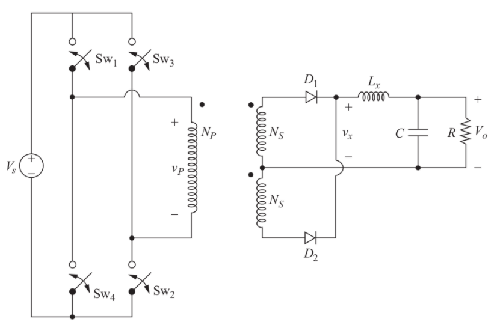
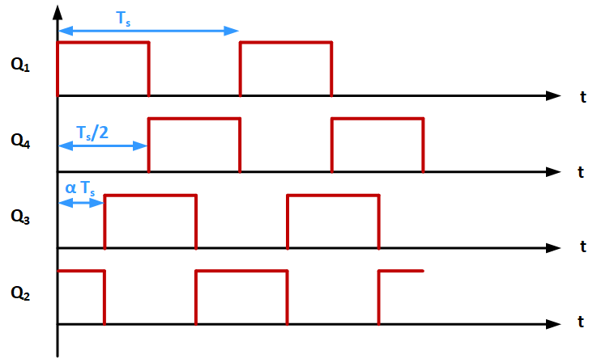

# EE 464 Homework#2

## Full Bridge Isolating Converter Design

### Deadline: 02/05/2024 23:59

Please check [evaluation.md](evaluation.md) for other details and evaluation criteria about the project. Open a **private repository**, which you will put all your work into. Please add [Ogün](https://github.com/OgunAltun) as a collaborator.

You are required to design a 200 W full bridge isolating converter with 24 Vin and 200 Vout with 1% output voltage ripple. Switching frequency of the converter is 250kHz.

**1) Duty Controlled Full Bridge Converter** 

  **a)** Assuming operating duty cycle is 0.4, find the turns ratio of the transformer.

  **b)** Find the required inductance value so that the filter inductor current ripple is 20% of the average inductor current. Choose a commercial inductor using Digikey that is appropriate for your design. State your reasonings for your selection.

  **c)** Find the output capacitor value to meet the output voltage ripple requirements. Choose a commercial capacitor(s) using Digikey that is appropriate for your design. State your reasonings for your selection.

  

**2) Transformer Design** 

The total loss of transformer should not exceed 25 W and fill factor of the core should not be less than 30%.

It is strongly advised to use programs such as Matlab or Excel, since magnetic design can be a tedious job which may require a few iterations to find the optimum parameters. A simple script would save you from losing your precious hours.

  **a)** Design your transformer with cores which can be found on [Magnetics](https://www.mag-inc.com/Products/Ferrite-Cores/Ferrite-Shapes). Clearly indicate the reasoning behind choosing the core. Find the primary and secondary number of turns. Calculate the magnetizing inductance of the transformer. (Hint: Magnetics has some great design guides for inductor and transformer designs. Please have a look at those guidelines.)

  **b)** With current density being 4 A/mm2, find an [AWG cable](https://www.powerstream.com/Wire_Size.htm) according to the switching frequency and current value. Firstly, calculate the fill factor of the transformer with the chosen cable. Is it a reasonable value? Then, calculate the cable DC and AC resistances and copper loss of the transformer (Proximity can be ignored).  

  **c)** Calculate the core loss of the transformer using core loss formulas given by the manufacturer and compare it with previously found copper loss value. Does your design require new iterations?

**3) Simulation** 

**Important Note:** MOSFET and transformer are current based modelled in Simulink. Series connection of these components may results in unexpected simulations. You can conncect parallel output capacitance to the MOSFETs so that simulation works well.

**a)** Construct a simulation on Simulink with resistances of the inductor and transformer. Check if the circuit meets the requirements. Plot the following waveforms. Comment on the results and explain if you observe any discrepancy from analytical calculations. Also find the required rating of the semiconductors according to simulation. Yo do not need to select commercial products.

* Vo
* Vx
* VL
* iL
* Vsw1

**b)** Real transformers have leakage inductances as a small portion of the magnetizing inductance. What would you observe in real case scenario with leakage inductances. Comment on it.

**c)** What is flux walking? What are the posibble reasons? Which type of converters are subject to this phenomena? Propose a method to overcome this problem.

**4) Converter Modifications** 

Now you want to modify your previous design and compare the performances.

  **a)** First you want to change the control technique of the converter. Instead of duty control, you apply the phase shift control for the output voltage regulation. Sample gate signals are shown in figure below. What is the required phase shift to obtain required output if you use the same transformer values? Verify your result with simulation. What might be the reason behind using this control technique? State the advantages and disadvantages.

  

  **b)** Assume that you need a bidirectional power flow between 24 V and 200 V. What modification is required for this applicaiton? Compare the modified topology with your first design. You do not need to simulate the converter.