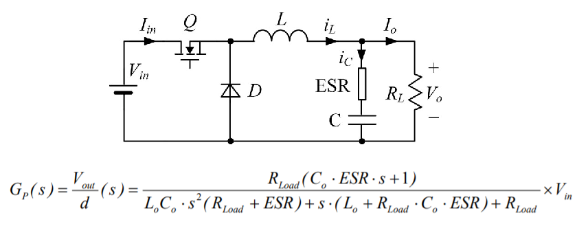

# EE 464 Homework#3

## Compensator Design for Buck Converter

### Deadline: 06/06/2020 23:59

Please check [evaluation.md](evaluation.md) for other details and evaluation criteria about the project. Open a **private repository**, which you will put all your work into. Please add [Ogün](https://github.com/OgunAltun) as a collaborator. 

In this project, you need to design a controller for a buck converter. You can use Simulink or LTSpice for simulations in this project. Keep in mind that whatever tool you are going to use, you should provide figures in a good quality as asked.

**Hints:**
You can check the following links.

- [Compensator Design Procedure for Buck Converter with Voltage-Mode Error-Amplifier](https://www.infineon.com/dgdl/an-1162.pdf?fileId=5546d462533600a40153559a8e17111a)
- [Type 2 and Type 3 Compensator Analysis for Power Supplies](https://www.plexim.com/support/application-examples/1026)
- [Design and Implementation of Type-II Compensator in DC-DC Switch-Mode Step-up Power Supply](http://iranswitching.ir/wp-content/uploads/2016/01/Design-and-Implementation-of-Type-II-Compensator-in-DC-DC-Switch-Mode-Step-up-Power-Supply_www.IranSwitching.ir_.pdf)
- [Visualize Bode Response of Simulink Model During Simulation](https://www.mathworks.com/help/slcontrol/ug/visualize-bode-response-of-simulink-model-during-simulation.html)
- [Bode Response of Simulink Model](https://www.mathworks.com/help/slcontrol/gs/bode-response-of-simulink-model.html)
- [LTspice: Basic Steps in Generating a Bode Plot of SMPS](https://www.analog.com/en/technical-articles/ltspice-basic-steps-in-generating-a-bode-plot-of-smps.html#)

**1)** Explain the meaning of input-to-output transfer function and control-to-output transfer function in words.

**2)** Obtain the bode plot for control-to-output transfer function of buck converter with and without ESR rC on single graph on MATLAB. How do nonidealities affect the characteristic? Comment on phase margin & gain margin.

The circuit parameters are:
* L = 10 uH
* C = 10 uF, rC = 10 mohm
* VIN = 5 V
* Vo = 3.3 V
* Io = 3 A  
* fsw = 200 kHz 
* Vref = 1.2 V 
* Vosc = 1.8 V 

#### Design

**3)** Identify the pole and zero frequencies for non-ideal buck converter. List them from lower to higher including switching frequency.

**You need to design two different compensators for this application and then you will compare. You can choose different crossover frequencies for two compensators or you can design two compensators with different phase-gain margins having same crossover frequency. It is advised you to apply different options and observe the bode plots and performances. At the end you need to report two of the options and compare performances. Final designs should be stable.**

**4)** What does a crossover frequency mean? What is the typical limit for a crossover frequency? Select a crossover frequency for your application, give your reasoning.

**5)** There are different types of compensator such as Type-I, Type-II, Type-III A or B. Pick the most suitable one for your design. Give your reasoning.

**6)** Calculate the values of the circuit components for your each compensator. Round up or down the component ratings to the available ratings. For example, 4.68 nF turns into 4.7 nF. 

**7)** Obtain the bode plots of the loop transfer functions for each compensator design. Show and comment on phase margins. You do not need to simulate system for this step. Bode plots of MATLAB transfer functions are acceptable.

#### Simulation

**8)** Give the transient waveform for output voltage, inductor current and duty cycle (0<x<1) for each compensator design when load is switched from full to half. Explain what happens at that moment briefly.

**9)** Give the transient waveform for output voltage, inductor current and duty cycle (0<x<1) for each compensator design when load is switched from half to full. Explain what happens at that moment briefly.

**10)** Give the transient waveform for output voltage, inductor current, input voltage and duty cycle (0<x<1) for each compensator design when input voltage drops to 4 V as a step change. Explain what happens at that moment briefly. Does your compensator still helps to regulate output voltage?

**11)** Compare performance of the designs in terms of overshoot, settling time, oscillation etc. Do not forget to mention how the design parameters (phase-gain margins, crossover frequency) affect performance.

**12) Bonus** How much time did you spend for this homework?
