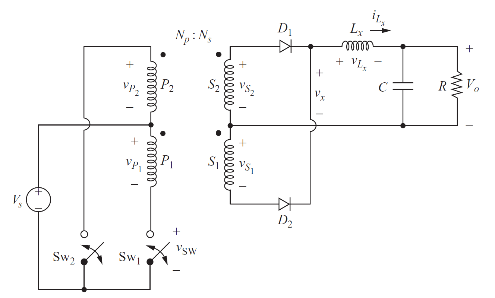

# EE 464 PROJECT#2

## Push-Pull Converter Design

### Deadline: 05/04/2020 23:59

Please check [evaluation.md](evaluation.md) for other details and evaluation criteria about the project. Open a **private repository**, which you will put all your work into. Please add me(/ozank), Furkan(/furkankarakaya) or other Furkan(/tokgozfurkan) as a collaborator.

Your boss at Hebelsan was very satisfied with your previous design. After giving you a salary bonus -there is no free lunch-, he asked you to design a 96 W push-pull converter with 48 Vin and 12 Vout with 1% output voltage ripple at 40 kHz.

**1) Analytical Calculation** 

  Assuming continuous conduction mode,

  **a)** Derive the Vout/Vin transfer function of the push-pull converter.

  **b)** Derive the output voltage ripple formula.

**2) Circuit parameters** 

  **a)** Assuming operating duty cycle is 0.25, find the turns ratio of the transformer.

  **b)** Find the required inductance value so that the filter inductor current ripple is 10% of the average inductor current.

  **c)** Find the output capacitor value to meet the output voltage ripple requirements.

  

**3) Magnetic Design** 

The total loss of magnetic components -transformer and inductor- should not exceed 15 W and fill factor of the cores should not be less than 30%.

It is strongly advised to use programs such as Matlab or Excel, since magnetic design can be a tedious job which may require a few iterations to find the optimum parameters. A simple script would save you from losing your precious hours.

  **a)** Design your transformer with cores which can be found on [Magnetics](https://www.mag-inc.com/Products/Ferrite-Cores/Ferrite-Shapes). Clearly indicate the reasoning behind choosing the core. Find the primary and secondary number of turns. Calculate the magnetizing inductance of the transformer. (Hint: Magnetics has some great design guides for inductor and transformer designs. Please have a look at those guidelines.)

  **b)** With current density being 4 A/mm2, find an [AWG cable](https://www.powerstream.com/Wire_Size.htm) according to the switching frequency and current value. Firstly, calculate the fill factor of the transformer with the chosen cable. Is it a reasonable value? Then, calculate the cable DC and AC resistances and copper loss of the transformer (Proximity can be ignored).  

  **c)** Calculate the core loss of the transformer using core loss formulas given by the manufacturer and compare it with previously found copper loss value. Does your design require new iterations?

  **d)** Design the output inductor with cores on [Magnetics](https://www.mag-inc.com/Products/Powder-Cores/Kool-Mu-Cores). Find the required number of turns and make sure that core is not saturated by checking the DC bias curves of the material.

  **e)** Choose appropriate AWG cable for the design with 4 A/mm2 current density and calculate the fill factor. Is it a reasonable value? Then, calculate the cable DC and AC resistances and copper loss of the inductor.

  **f)** Calculate the core loss of the inductor and compare it with previously found copper loss value. Does your design require new iterations?

**4) Simulation** 

**a)** Choose commercial products from [Digikey](https://www.digikey.com/) for semiconductors and capacitors. Explain the reasoning behind choosing those components.

**b)** Construct a simulation on Simulink with **with non-idealities**, meaning ESR value of the capacitor, calculated cable resistances of the inductor and transformer, semiconductors' parameters, which you can find in the datasheets of the products. Check if the circuit meets the requirements. Plot the following waveforms:

* Vo
* Vx
* VL
* iL
* Vsw1

**c)** Now, add 1% of the calculated magnetizing inductance of the transformer as the leakage inductance of the transformer's primary side. Plot the following waveforms and comment on what might be the cause of the changes in the waveforms. Offer a solution for this problem.

* Vx
* Vsw1

**d)** Comment on the results and explain if you observe any discrepancy from analytical calculations.

**e)** Lets consider S1 and S2 windings turn numbers are not identical due to practical considerations. What could this difference results in? Propose a method to solve this problem.

**5) Bonus** How much time did you spend for this homework? (Bonus)
