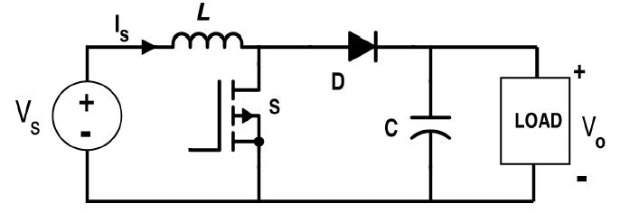
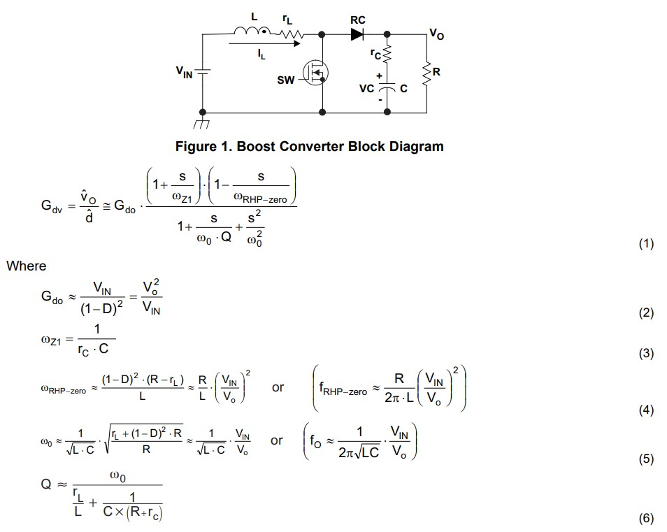

# EE 464 PROJECT#3

## Compensator Design for a Boost Converter

### Deadline: 26/04/2020 23:59

Please check [evaluation.md](evaluation.md) for other details and evaluation criteria about the project. Open a **private repository**, which you will put all your work into. Please add me(/ozank), Furkan(/furkankarakaya) or other Furkan(/tokgozfurkan) as a collaborator.

In this project, you need to design a controller for a boost converter. You can use Simulink or LTSpice for simulations in this project. Keep in mind that whatever tool you are going to use, you should provide figures in a good quality as asked.

  

**1)** Explain the meaning of input-to-output transfer function and control-to-output transfer function in words.

**2)** Derive input-to-output CCM transfer function of an ideal boost converter in the standard form. Show your steps clearly. Use ***L*** for inductance, ***C*** for capacitance, ***R*** for load resistance and ***D*** for duty cycle.

**3)** Derive control-to-output CCM transfer function of an ideal boost converter in the standard form. Show your steps clearly. Use ***L*** for inductance, ***C*** for capacitance, ***R*** for load resistance and ***D*** for duty cycle.

**4)** Obtain a bode plot for control-to-output transfer function of an ideal and a non-ideal boost converter on single graph. How do nonidealities affect the characteristic? Comment on phase margin & gain margin.

The circuit parameters are:
* L = 10 uH, RL = 15 mohm
* C = 100 uF, RL = 25 mohm
* VIN = 3 V
* Vo = 3.6 V
* Io = 2 A  
* fsw = 50 kHz 
* You need to decide the duty-cycle for both cases.

#### Design

**5)** Identify the pole and zero frequencies for non-ideal boost converter. List them from lower to higher including switching frequency.

**6)** What does a crossover frequency mean? What is the typical limit for a crossover frequency? Select a crossover frequency for your application, give your reasoning.

**7)** There are different types of compensator such as Type-I, Type-II, Type-III A or B. Pick the most suitable one for your design. Give your reasoning.

**8)** Calculate the values of the circuit components for your compensator. Round up or down the component ratings to the available ratings. For example, 4.68 nF turns into 4.7 nF.

**9)** Obtain the bode plot for your closed loop control. Show and comment on phase and gain margins.

**10)** Give the transient waveform for output voltage, inductor current and duty cycle (0<x<1) when load is switched from full to half. Explain what happens at that moment briefly.

**11)** Give the transient waveform for output voltage, inductor current and duty cycle (0<x<1) when load is switched from half to full. Explain what happens at that moment briefly.

**12)** Assume that you are obtaining the feedback from output using long cables. Therefore, the path inductance gets important. Add 200 nH on the feedback path and obtain the bode plot for closed loop control again. Compare and comment on the differences.

**13) Bonus** How much time did you spend for this homework? (Bonus)

**Hints:**
You can check the following links.

- [Compensator Design Procedure for Buck Converter with Voltage-Mode Error-Amplifier](https://www.infineon.com/dgdl/an-1162.pdf?fileId=5546d462533600a40153559a8e17111a)
- [Type 2 and Type 3 Compensator Analysis for Power Supplies](https://www.plexim.com/support/application-examples/1026)
- [Design and Implementation of Type-II Compensator in DC-DC Switch-Mode Step-up Power Supply](http://iranswitching.ir/wp-content/uploads/2016/01/Design-and-Implementation-of-Type-II-Compensator-in-DC-DC-Switch-Mode-Step-up-Power-Supply_www.IranSwitching.ir_.pdf)
- [Visualize Bode Response of Simulink Model During Simulation](https://www.mathworks.com/help/slcontrol/ug/visualize-bode-response-of-simulink-model-during-simulation.html)
- [Bode Response of Simulink Model](https://www.mathworks.com/help/slcontrol/gs/bode-response-of-simulink-model.html)
- [LTspice: Basic Steps in Generating a Bode Plot of SMPS](https://www.analog.com/en/technical-articles/ltspice-basic-steps-in-generating-a-bode-plot-of-smps.html#)
