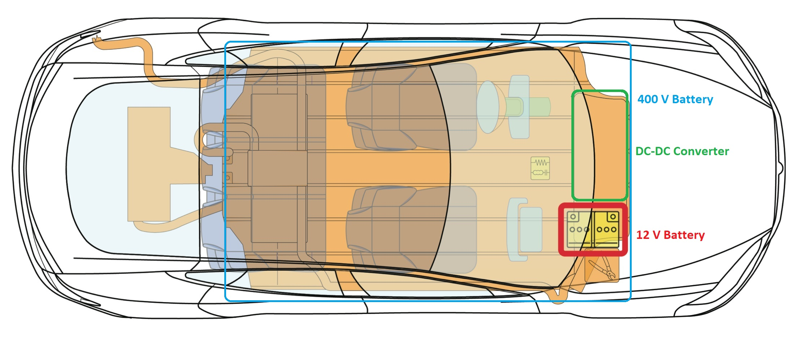
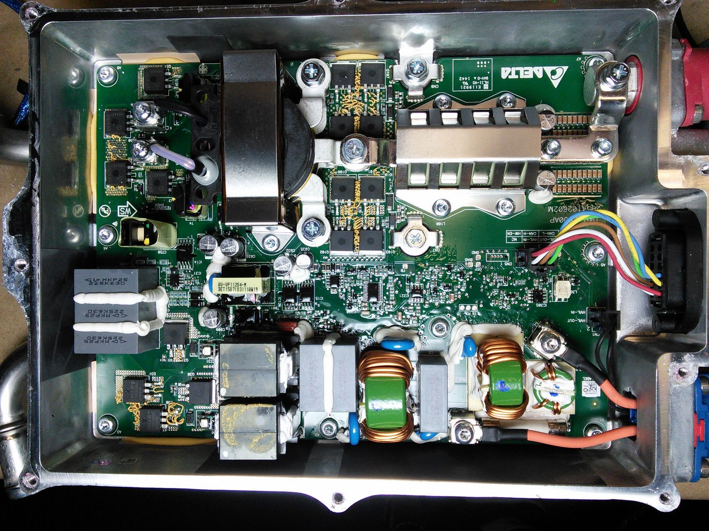

# EE464 Term Project

### Deadlines
- Complete Simulation Report - 2nd of May
- Presentation for Feedback Session - 8th of May
- Final Report - 3rd of July
- Final Presentation - 13th of July
- Video - 14th of July

In Tesla Model S, a 400V high voltage battery is placed in order to supply power to motor drive unit. In addition to high voltage battery, Model S has a 12V low voltage battery. Low voltage electrical devices such as air conditioner, touchscreen, interior and exterior lights etc are powered by this battery.

A DC-DC converter is utilized to charge 12V battery from 400V high voltage battery. The 2500W DC-DC converter used in Model S is shown below.

In this project you are going to design a similar isolated DC-DC converter that is used in Tesla Model S. Specs for the project are listed below. You can choose Forward/Flyback topology as in the previous years projects or any isolated converter topology.

### Specs:

Specifications of the system are listed as follows:

 - **Minimum Input Voltage**: 220 V
 - **Maximum Input Voltage**: 400 V
 - **Output Voltage**: 12 V
 - **Output Power**: 100 W
 - **Output Voltage Peak-to-Peak Ripple**: 4%
 - **Line Regulation**(Deviation of percent output voltage when input voltage is changed from its minimum to maximum or vice versa): 3%
 - **Load Regulation**(Deviation of percent output voltage when load current is changed from 10% to 100% or vice versa): 3%
 

### Project Steps:
 - You need to form a group of 3 students. You are not allowed to have a group with any of your group members from the first semester. Once you determined your group members, please write it up in [this spreadsheet](https://docs.google.com/spreadsheets/d/1RBKi7wy2ubUXUBBDquMFK0ZKWQU04NQv9kfi01Kxl5I/edit?usp=sharing).
 - Create a **public repo**: Open a public repo, which you will put all your work into. Please add [Keysan](https://github.com/ozank) and [Ogün](https://github.com/OgunAltun) as collaborator.
 - **Topology Selection**: Discuss the advantages and disadvantages of each topology, and decide on a topology. You are required prepare a document to support your decision. Put the selected topology on the [group member spreadsheet](https://docs.google.com/spreadsheets/d/1RBKi7wy2ubUXUBBDquMFK0ZKWQU04NQv9kfi01Kxl5I/edit?usp=sharing).
 - **Analytical Calculations and Simulations**: After choosing the topology, you need to find the circuit parameters such as values of inductors and capacitors, duty cycle, transformer turns ratio, maximum voltage and current ratings of the circuit components.
 - **Component Selection**: According to your analytical calculations and/or simulations, decide on which components you are going to use. Not only choose the power components, but also decide on the control, and auxiliary components. Use [Digikey](https://www.digikey.com/) as your supplier and record the cost of the components. Loss -switching, conduction- calculations of the components should be done, after the component selection is completed.  With calculated thermal loss values, find the temperature of the components by assuming 25&deg;C ambient temperature. If necessary select a heatsink and do the thermal calculations again. 
 - **Magnetic Design**: You need to design magnetic components according to your analytical calculations and/or simulations. Choose suitable core from [Magnetics](https://www.mag-inc.com/) or any other supplier and do the necessary calculations.
 - **Controller**: Closed loop control is a must. Choose an analog controller and find necessary compensation components to provide stable output voltage. You need to simulate the closed loop response of your converter and controller. Hence, choosing integrated circuits which have available spice models is suggested. For LTspice simulations, choosing IC's from [Analog Devices](https://www.analog.com/) is suggested since most of the porducts are available in LTspice library. For other companies, you may found LTspice models in the Web, but it might be time consuming and they might not work correctly. For [Texas Instruments](https://www.ti.com/) devices, you can use [PSpice for TI](https://www.ti.com/tool/PSPICE-FOR-TI) or [TINA-TI](https://www.ti.com/tool/TINA-TI) tools.
 - **Detailed Simulations**: You are going to run computer simulations, to prove the performance characteristics of your circuit. Simulate the circuit with all the parasitic elements that you can add to the simulation such as: Non-ideal semiconductor characteristics (conduction loss, switching time forward voltage etc), non-ideal characteristics of your magnetic design such as coil resistance, leakage inductance (can be assumed 1-2% of the magnetizing inductance), non-ideal characteristics of the filter elements such as capacitor and inductor. **You need to simulate the converter with designed controller.** 
- **Implementation**: Using PCB design softwares such as KiCad, Altium Designer, Proteus, construct the schematic of your design. Add all footprints and 3D models of the components that you have used. Then, draw the PCB layout of the designed circuit while concerning practical usage. Some [tips](http://www.onmyphd.com/?p=pcb.design) about PCB layout can be helpful in this part of the project. Add 3D model of the circuit components. You can use following websites to find 3D models: [Snapeda](https://www.snapeda.com/), [3D Content](https://www.3dcontentcentral.com/). You need to present the followings in your report or repo: Complete PCB schematic, PCB layout design, and the [gerber](https://en.wikipedia.org/wiki/Gerber_format) files for production ( [How to PCBs work?](https://www.youtube.com/watch?v=H9pGbLJknDk)), Bill of Materials, [3D view](https://kicad-pcb.org/discover/3dviewer/) of your design, total cost of manufacturing 1000 pieces of your converter (Get a PCB manufacturing quote from [PCBWay](https://www.pcbway.com/))

### Bonus Parts:

There will be bonuses for some groups -not necessarily to a single group-.

- **Industrial Design Bonus:** A bonus will be awarded to a project with the smallest volume (including all cabling, control circuitry, filters etc). You should put the circuit in a box, whose examples can be found in this [website](https://www.altinkaya.com.tr/). When calculating volume of the design, volume of the box will be used.

- **Cheapest Design Bonus:** A bonus will be awarded to design with the cheapest unit price.

- **Best PCB Bonus:** An award will be given for best designed PCB.

- **Thermal Simulation Bonus:** This bonus will be given to students who run a thermal simulation on a CAD program such as Autocad, Solidworks etc. You should use the 3D model of your PCB and thermal loss calculations to run the simulations. If you are using a heatsink, you should add the heatsink model as well.

- **Best Video Bonus:** Just get creative, and try to get a fun and informative video to describe your project progress. A video telling your story during the design process and project implementation. Videos of maximum 3 min should be uploaded to YouTube (or any other online video hosting website). Each team member should appear in the video.

- **Karma Bonus:** This bonus will be awarded to one person who helps most to everyone during the project period. This bonus will be awarded by the results of anonymous voting in the demo day.

- **Non-Isolated Output:** If the isolation between the input side and output side is broken for any reason, you will get a penalty with negative bonus.

- **Protection Circuits:** Construct protection circuits to keep your design safe under various conditions. Overvoltage Protection: Your design should not be harmed if the supply voltage is larger than ratings. Overcurrent Protection: The output of the conveter you designed may be shorted, or dangerous output current may flow due to faulty connections. Your design should be capable of cutting the power before any damage. Reverse Polarity Connection: The input cabling may be reversed. Your design should not be harmed for this operation. An indicator may be used to correct the polarity. You do not need to include all of them in your design. Partial credit will be given. If you have any other protection for possible faults, you will be awarded for them also.

- **Extra Effort Bonus:** All of the additional converter merits such as synchronous switching, parallel converter operation and any other effort that you put outside this project definition will be awarded in grading, accordingly.

### Grading

- **Preliminary Simulation Report and Presentation (25 pts):** A report that presents your design decisions, computer simulations, and component selection for the all parts of the project. Similar grading rules apply with previous projects (i.e. format, number of commits etc). Each team should present their topology selection and project design. They should describe how they selected critical components and their plan for design and manufacturing. You need to report and present your magnetic designs for feedback. You need to start controller selection and report/present your ideas even if it is not completed. You also need to show PCB designs so that you can have feedback for better designs.

- **Complete Design Report (50 pts):** A report that presents your design decisions, computer simulations, and component selection. Similar grading rules apply with previous projects (i.e. format, number of commits etc.). Reports and all relevant files should be submitted from GitHub.

- **Complete Design Presentation (25 pts):** Each team is expected to present their final designs.

### Hints:

Have a look at the hardware project presentation by course assistants [here](https://prezi.com/zqhrvmqz0ik5/ee463-hardware-project/).

TI shares a lot of its designs, in detail. Please check: http://www.ti.com/general/docs/refdesignsearchresults.tsp

It is strongly advised to read application notes about your project topology. You can find converter designs on web and (partly) utilize their solution by properly citing them. Do not try to find an overall design to evade the design effort. We also have a large collection of converter designs published online.

[Here](https://www.diyelectriccar.com/threads/tesla-dc-dc-converter-hacking.192042/) you can find the converter used in Tesla Model S. Cabling, connections etc may be useful for your designs.

# Past Years' Projects

### 2021 Teams

- [Group Isolated](https://github.com/busranurkocak/EE464-Term-Project): Büşra Nur Koçak, Defne Nur Korkmaz, Mustafa Mert Sarıkaya
- [Social Isolation](https://github.com/alibelli/EE464_term_project_Social_Isolation): Ali Belli, Ahmet Halis Sabırlı, Berkay Uzun
- [PL Electronics](https://github.com/emin3397/EE464-Project): Emin Ün, Emre Karabakla, Görkem Gülletutan
- [Martian Power Solutions](https://github.com/EnesCanbolat/EE464_Project): Ceyhun Koç, Eren Özkara, Enes Canbolat
- [Power Rangers](https://github.com/cayunus/EE464-TermProject): Mehmet Kılıç, Halid Filiz, Yunus Çay
- [Doge Power](https://github.com/mustafayildz/EE464-Term-Project-): Mustafa Yıldız, Onur Öztaş

### 2021 Videos

- [Social Isolation](https://www.youtube.com/watch?v=jwg66FybZuE) (Best Video Bonus Winner)
- [Martian Power Solutions](https://www.youtube.com/watch?v=5G3i6zLux1E) (Best Video Bonus Winner)
- [Power Rangers](https://www.youtube.com/watch?v=DTsM74_svPk) (Best Video Bonus Winner)
